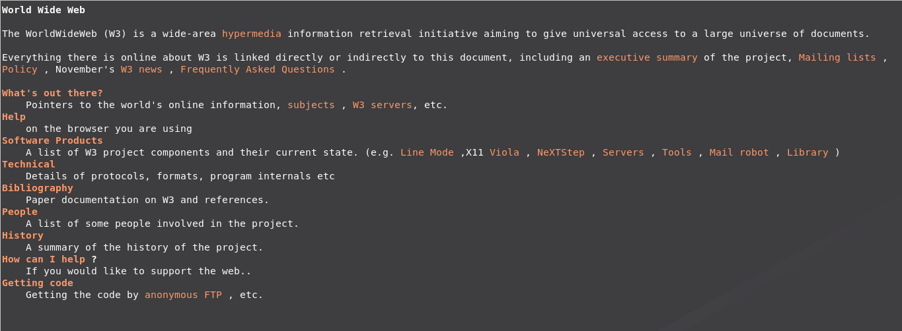
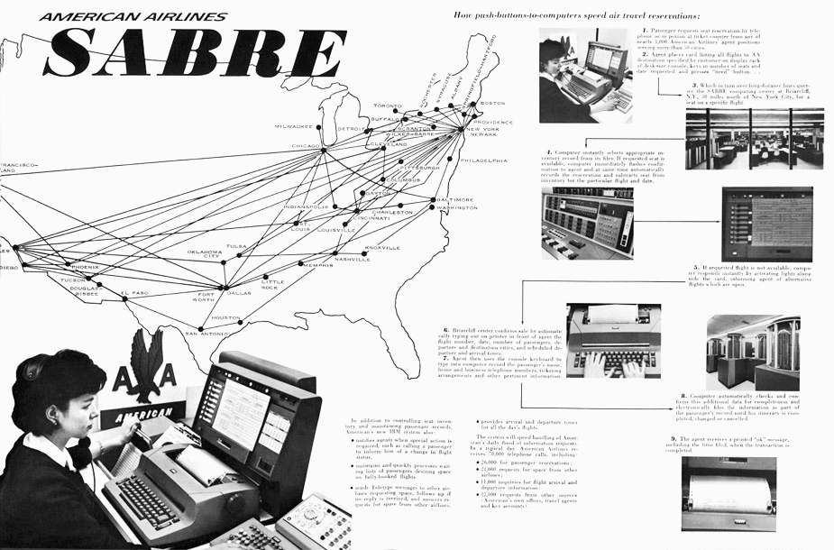
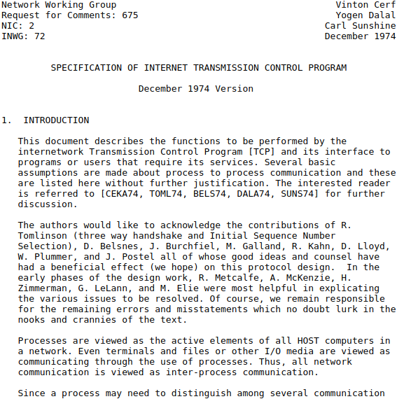
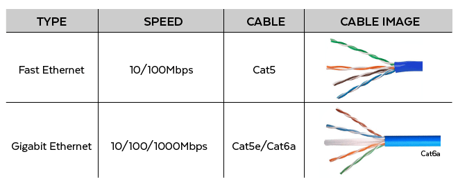
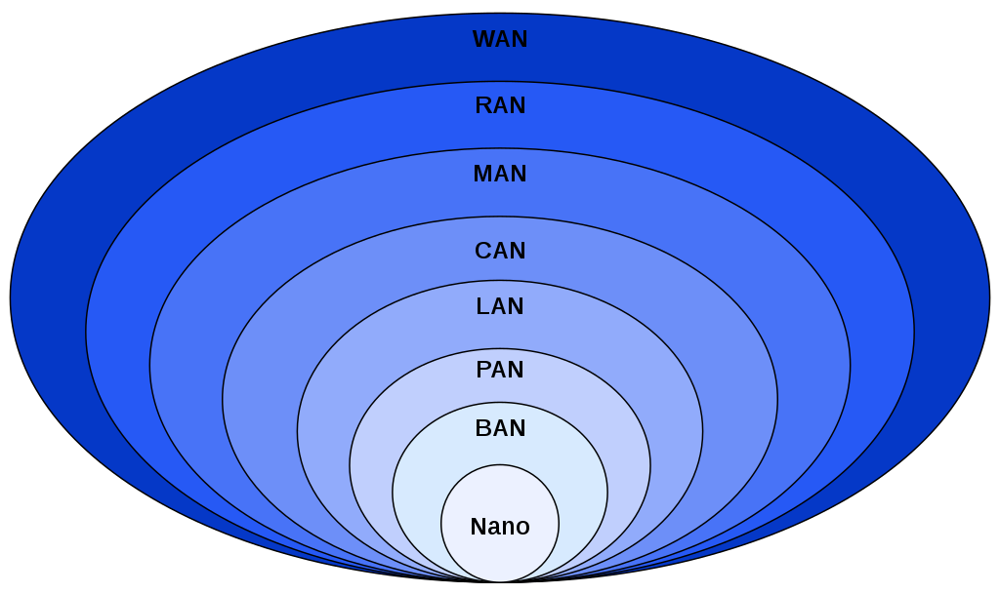

---
**HISTORIA Y EVOLUCIÓN DE LAS REDES DE COMPUTADORAS**
---

---

---

---
- **Alumno :** Jahir Medina
- **Codigo :** 1012700115
- **Curso :** Comunicacion de Datos
---

---
**NOVIEMBRE , 2020**
---

# Introducción

Las redes informáticas son el resultado lógico de la evolución de las tecnologías informáticas y de comunicaciones.
Representan un caso particular de los sistemas informáticos distribuidos y pueden considerarse un medio para transmitir información durante mucho tiempo
distancias.

Con este último propósito, implementan la codificación y multiplexación de datos
métodos desarrollados y adoptados en diversos sistemas de comunicaciones.
Todas las redes pueden clasificarse, en función de su ubicación geográfica, en las siguientes categorías: redes de área amplia (WAN), redes de área local (LAN) y redes de área metropolitana (MAN).
Cronológicamente, las WAN fueron las primeras redes en aparecer.

Conectan computadoras distribuidas a lo largo de cientos de kilómetros.
A menudo se basan en los enlaces de comunicaciones existentes de baja calidad, lo que da lugar a bajas velocidades de transmisión de datos.
Comparadas con las LAN, las WAN proporcionan un conjunto limitado de servicios, principalmente transferencia de archivos y correo electrónico, en segundo plano y no en tiempo real.
Las LAN suelen cubrir regiones en un radio no superior a 1,5 millas.

Se basan en enlaces de conexión caros y de alta calidad que permiten métodos sencillos de transmisión de datos a velocidades de intercambio de datos más altas (unos 100 Mbps) que las permitidas por las WAN.
Por lo general, las LAN proporcionan una gama de servicios implementados en línea.
Las MAN están pensadas para servir a las grandes ciudades.

Al caracterizarse por distancias bastante largas entre los nodos de la red (a veces decenas de millas) también proporcionan enlaces de comunicaciones de alta calidad y soportan altas velocidades de intercambio de datos.
Los MAN aseguran la conexión económica y eficiente de las LAN, proporcionándoles acceso a las WAN.
La etapa más importante de la evolución de las redes informáticas fue la llegada de las tecnologías de redes estándar.

Estas incluyen Ethernet, FDDI y Token Ring.
Estas tecnologías permiten que diferentes tipos de computadoras se conecten rápida y eficientemente.
A finales de los años 80, las redes LAN y WAN se caracterizaron por diferencias significativas entre la longitud y la calidad de los enlaces de comunicaciones, la complejidad de los métodos de transmisión de datos, las tasas de intercambio de datos, la gama de servicios proporcionados y la escalabilidad.

Más tarde, como resultado de la estrecha integración de las redes LAN, WAN y MAN, se produjo la convergencia de estas tecnologías.
La tendencia a la convergencia de los diferentes tipos de redes es característica no sólo de las LAN y las WAN, sino también de otros tipos de redes de telecomunicaciones, incluidas las redes telefónicas, de radio y de televisión.
Por el momento, la investigación tiene por objeto crear redes universales multiservicio, capaces de transmitir eficazmente información de cualquier tipo, incluidos datos, voz y vídeo.

---

> [Primera Pagina Web de la Internet](http://info.cern.ch/hypertext/WWW/TheProject.html Primera Pagina Web de la Internet)
---

# Historia y Evolución

Las redes informáticas pueden considerarse una rama de la informática, la ingeniería informática y las telecomunicaciones, ya que se basan en la aplicación teórica y práctica de estas disciplinas. La creación de redes informáticas se vio influenciada por una amplia gama de avances tecnológicos e hitos históricos.

- A finales de la década de 1950, las primeras redes de computadoras incluían el sistema de radar militar de los Estados Unidos Semi-Automatic Ground Environment (SAGE).

- En 1959, Christopher Strachey presentó una solicitud de patente para el tiempo compartido y John McCarthy inició el primer proyecto para implementar el tiempo compartido de los programas de usuario en el MIT. Stratchey pasó el concepto a J. C. R. Licklider en la Conferencia inaugural de la UNESCO sobre el procesamiento de la información en París ese año. McCarthy fue instrumental en la creación de tres de los primeros sistemas de tiempo compartido (Sistema de Tiempo Compartido Compatible en 1961, Sistema de Tiempo Compartido BBN en 1962, y Sistema de Tiempo Compartido Dartmouth en 1963).

- En 1959, Anatolii Ivanovich Kitov propuso al Comité Central del Partido Comunista de la Unión Soviética un plan detallado para la reorganización del control de las fuerzas armadas soviéticas y de la economía soviética sobre la base de una red de centros de computación, el OGAS.

- En 1959, el transistor MOS fue inventado por Mohamed Atalla y Dawon Kahng en Bell Labs. Más tarde se convirtió en uno de los bloques de construcción básicos y en "caballos de batalla" de prácticamente cualquier elemento de la infraestructura de comunicaciones.

- En 1960, el sistema de reservaciones de las aerolíneas comerciales semi-automáticas del entorno de investigación de negocios (SABRE) se puso en línea con dos mainframes conectados.

---

> Publicidad Resumen del sistema SABRE
---

- En 1963, J. C. R. Licklider envió un memorándum a sus colegas de oficina en el que se analizaba el concepto de la "Red Informática Intergaláctica", una red informática destinada a permitir las comunicaciones generales entre los usuarios de computadoras.

- A lo largo de la década de 1960, Paul Baran y Donald Davies desarrollaron de forma independiente el concepto de conmutación de paquetes para transferir información entre ordenadores a través de una red. Davies fue pionero en la aplicación del concepto con la red NPL, una red de área local del Laboratorio Nacional de Física (Reino Unido) que utiliza una velocidad de línea de 768 kbit/s.

- En 1965, Western Electric introdujo el primer conmutador telefónico de uso generalizado que implementó el control por computadora en el tejido de conmutación.

- En 1969, los primeros cuatro nodos de la ARPANET se conectaron mediante circuitos de 50 kbit/s entre la Universidad de California en Los Ángeles, el Instituto de Investigación de Stanford, la Universidad de California en Santa Bárbara y la Universidad de Utah. En la década de 1970, Leonard Kleinrock llevó a cabo un trabajo matemático para modelar el rendimiento de las redes de conmutación de paquetes, lo que sirvió de base para el desarrollo de ARPANET. Su trabajo teórico sobre el enrutamiento jerárquico a finales del decenio de 1970 con el estudiante Farouk Kamoun sigue siendo fundamental para el funcionamiento de la Internet en la actualidad.

- En 1972 se desplegaron servicios comerciales que utilizaban X.25, que más tarde se utilizaron como infraestructura subyacente para ampliar las redes TCP/IP.

---

> [Protocolo TCP/IP](https://tools.ietf.org/rfc/rfc675.txt Protocolo TCP/IP)
---

- En 1973, la red francesa CYCLADES fue la primera en responsabilizar a los anfitriones de la entrega fiable de datos, en lugar de ser un servicio centralizado de la propia red.

- En 1973, Robert Metcalfe escribió un memorando formal en Xerox PARC describiendo Ethernet, un sistema de red que se basaba en la red Aloha, desarrollada en la década de 1960 por Norman Abramson y sus colegas de la Universidad de Hawai. En julio de 1976, Robert Metcalfe y David Boggs publicaron su artículo "Ethernet: Distributed Packet Switching for Local Computer Networks" y colaboraron en varias patentes recibidas en 1977 y 1978.

- En 1974, Vint Cerf, Yogen Dalal y Carl Sunshine publicaron la especificación del Protocolo de Control de Transmisión (TCP), RFC 675, acuñando el término Internet como una abreviatura de Internetworking.

- En 1976, John Murphy de Datapoint Corporation creó ARCNET, una red de paso de fichas que se utilizó por primera vez para compartir dispositivos de almacenamiento.

- En 1977, la primera red de fibra de larga distancia fue desplegada por GTE en Long Beach, California.

- En 1977, los sistemas de red de Xerox (XNS) fueron desarrollados por Robert Metcalfe y Yogen Dalal en Xerox.

- En 1979, Robert Metcalfe persiguió hacer de Ethernet un estándar abierto.

- En 1980, Ethernet fue actualizado del protocolo original de 2,94 Mbit/s al protocolo de 10 Mbit/s, que fue desarrollado por Ron Crane, Bob Garner, Roy Ogus y Yogen Dalal.

- En 1995, la capacidad de velocidad de transmisión de Ethernet aumentó de 10 Mbit/s a 100 Mbit/s. Para 1998, Ethernet soportaba velocidades de transmisión de un Gigabit. Posteriormente, se añadieron velocidades más altas de hasta 400 Gbit/s (a partir de 2018). El aumento de escala de Ethernet ha sido un factor que ha contribuido a que se siga utilizando.

---

> Diferencias en el trensado y composicion de los cables de Ethernet
---

# Estructuras de las Redes de Computadoras

## Niveles de las Redes de Computadoras, Por su Alcance Estructural

Una red puede clasificarse según su uso y los servicios que ofrece. Esta división también se superpone con la noción de escala. Así pues, para las redes que utilizan tecnologías de Internet (familia de protocolos TCP/IP), la nomenclatura es la siguiente:

- **Intranet** : la red interna de una entidad organizativa.
- **Extranet** : la red externa de una unidad organizativa
- **Internet** : la red de redes interconectadas alrededor del mundo

---

> Vista del Internet, Ordenado por conexiones,
> Categorizado por volumen de trafico neto.
---

## Niveles de las Redes de Computadoras, Por Alcance Geografico

Una red puede caracterizarse por su capacidad física o su propósito organizativo. El uso de la red, incluida la autorización de los usuarios y los derechos de acceso, difiere en consecuencia.

### Red de Nanoescala (Nanoescala)
Una red de comunicaciones a nanoescala tiene componentes clave implementados a nanoescala, incluidos los portadores de mensajes, y aprovecha principios físicos que difieren de los mecanismos de comunicación a macroescala. La comunicación a nanoescala extiende la comunicación a sensores y actuadores muy pequeños, como los que se encuentran en los sistemas biológicos, y también tiende a funcionar en entornos que serían muy difíciles para la comunicación clásica

### Red de área personal (PAN)
Una red de área personal (PAN) es una red informática utilizada para la comunicación entre una computadora y diferentes dispositivos de tecnología de la información cerca de una persona. Algunos ejemplos de dispositivos que se utilizan en un PAN son las computadoras personales, las impresoras, las máquinas de fax, los teléfonos, los PDA, los escáneres e incluso las consolas de videojuegos. Un PAN puede incluir dispositivos alámbricos e inalámbricos. El alcance de un PAN se extiende típicamente hasta 10 metros. Un PAN alámbrico se construye típicamente con conexiones USB y FireWire mientras que las tecnologías como Bluetooth y la comunicación por infrarrojos típicamente forman un PAN inalámbrico.

### Red de área local (LAN)
Una red de área local (LAN) es una red que conecta computadoras y dispositivos en una zona geográfica limitada, como un hogar, una escuela, un edificio de oficinas o un grupo de edificios situados en una posición cercana. Cada computadora o dispositivo de la red es un nodo. Las redes LAN cableadas se basan muy probablemente en la tecnología Ethernet. Las normas más recientes, como la G.hn del UIT-T, también proporcionan una forma de crear una LAN alámbrica utilizando el cableado existente, como los cables coaxiales, las líneas telefónicas y las líneas de energía.

Las características que definen una LAN, en contraste con una red de área amplia (WAN), incluyen tasas de transferencia de datos más altas, alcance geográfico limitado y la falta de dependencia de líneas arrendadas para proporcionar conectividad. Las actuales tecnologías de Ethernet u otras tecnologías de LAN 802.3 del IEEE funcionan a velocidades de transferencia de datos de hasta 100 Gbit/s, normalizadas por el IEEE en 2010. Actualmente, se está desarrollando una Ethernet de 400 Gbit/s.

Una LAN puede conectarse a una WAN mediante un router.

---

> Red LAN
---

#### Red de contactos en casa (HAN)
Una red de área doméstica (HAN) es una red LAN doméstica utilizada para la comunicación entre los dispositivos digitales normalmente desplegados en el hogar, generalmente un pequeño número de computadoras y accesorios personales como impresoras y dispositivos de computación móviles. Una función importante es compartir el acceso a la Internet, a menudo un servicio de banda ancha a través de un proveedor de televisión por cable o una línea de suscripción digital (DSL).

#### Red de almacenamiento (SAN)
Una red de área de almacenamiento (SAN) es una red dedicada que proporciona acceso a un almacenamiento de datos consolidado a nivel de bloque. Las redes SAN se utilizan principalmente para crear dispositivos de almacenamiento, como matrices de discos, bibliotecas de cintas y rocallas ópticas, accesibles a los servidores, de modo que los dispositivos aparezcan como dispositivos conectados localmente al sistema operativo. Típicamente, una SAN tiene su propia red de dispositivos de almacenamiento a los que no suelen tener acceso otros dispositivos a través de la red de área local. El costo y la complejidad de las redes de seguridad social se redujeron a principios del decenio de 2000 a niveles que permitieron una mayor adopción en los entornos empresariales y en las pequeñas y medianas empresas.

### Red de área de campus (CAN)
Una red de área de campus (CAN) consiste en una interconexión de redes de área local (LAN) dentro de un área geográfica limitada. El equipo de red (conmutadores, enrutadores) y los medios de transmisión (fibra óptica, planta de cobre, cableado Cat5, etc.) son casi en su totalidad propiedad del inquilino o propietario del campus (una empresa, universidad, gobierno, etc.). Por ejemplo, es probable que la red de un campus universitario conecte una variedad de edificios del campus para conectar con las universidades o departamentos académicos, la biblioteca y las residencias de estudiantes.

### Red Metropolitana (MAN)
Una red de área metropolitana (MAN) es una gran red informática que suele cubrir una ciudad o un gran campus.

### Red de área amplia (WAN)
Una red de área amplia (WAN) es una red informática que cubre una gran área geográfica como una ciudad, un país o incluso distancias intercontinentales. Una WAN utiliza un canal de comunicaciones que combina muchos tipos de medios como líneas telefónicas, cables y ondas aéreas. Una WAN a menudo hace uso de los medios de transmisión proporcionados por empresas comunes, como las compañías telefónicas. Las tecnologías WAN funcionan generalmente en las tres capas inferiores del modelo de referencia OSI: la capa física, la capa de enlace de datos y la capa de red.

---

> Visualizacion de los Tipos de Redes por su Alcance Geografico 
---

- Nanoescala
- Cuerpo (BAN)
- Personal (PAN)
- Local (LAN)
- Campus (CAN)
- Metropolitano (MAN)
- Acceso por radio (RAN)
- Amplio (WAN)

## La red troncal
Una red troncal es parte de una infraestructura de red informática que proporciona un camino para el intercambio de información entre diferentes redes locales o subredes. Una columna vertebral puede unir diversas redes dentro de un mismo edificio, en diferentes edificios o en un área amplia.

Por ejemplo, una gran empresa puede poner en marcha una red troncal para conectar los departamentos que se encuentran en todo el mundo. El equipo que conecta las redes departamentales forma la columna vertebral de la red. Cuando se diseña una red troncal, el rendimiento de la red y la congestión de la misma son factores críticos a tener en cuenta. Típicamente, la capacidad de la red troncal es mayor que la de las redes individuales conectadas a ella.

Otro ejemplo de red troncal es la red troncal de Internet, que es el conjunto de redes de área extendida (WAN) y de enrutadores principales que enlazan todas las redes conectadas a la Internet.

# Referencias

1. **"Computer Pioneers - Christopher Strachey"**. history.computer.org. Retrieved 2020-01-23.
1. **"Reminiscences on the Theory of Time-Sharing"**. jmc.stanford.edu. Retrieved 2020-01-23.
1. **"Computer - Time-sharing and minicomputers"**. Encyclopedia Britannica. Retrieved 2020-01-23.
1. **Gillies, James M.; Gillies, James; Gillies, James and Cailliau Robert; Cailliau, R. (2000)**. How the Web was Born: The Story of the World Wide Web. Oxford University Press. pp. 13. ISBN 978-0-19-286207-5.
1. **Chris Sutton. "Internet Began 35 Years Ago at UCLA with First Message Ever Sent Between Two Computers".** UCLA. Archived from the original on 2008-03-08.
1. **Gillies, James; Cailliau, Robert (2000). How the Web was Born: The Story of the World Wide Web.** Oxford University Press. p. 25. ISBN 0192862073.
1. **C. Hempstead; W. Worthington (2005). Encyclopedia of 20th-Century Technology**. Routledge. ISBN 9781135455514.
1. **Bennett, Richard (September 2009). "Designed for Change: End-to-End Arguments, Internet Innovation, and the Net Neutrality Debate" (PDF).** Information Technology and Innovation Foundation. p. 11. Retrieved 2017-09-11.
1. **Robert M. Metcalfe; David R. Boggs (July 1976). "Ethernet: Distributed Packet Switching for Local Computer Networks".** Communications of the ACM. 19 (5): 395–404. doi:10.1145/360248.360253. S2CID 429216. Archived from the original on 2007-08-07.
1. **Redes de Coputadores Locais e de Longa Distância, Autor: Liane M. R.** Tarouco, 1986, Editora McGraw-Hill, ISBN 0-07-450477-0
1. **SOARES, Luiz Fernando Gomes; LEMOS, Guido; Colcher, Sérgio, Redes de Computadores: Das LANs, MANs e WANs às Redes ATM, 2. Ed.** revisada e ampliada, 4 reimpressão, Editora Campus, 1997, p. 10 - 28
1. **MAIA, Luiz Paulo, Arquitetura de Redes de Computadores,** Rio de Janeiro, LTC, 2009, p. 7, 37

