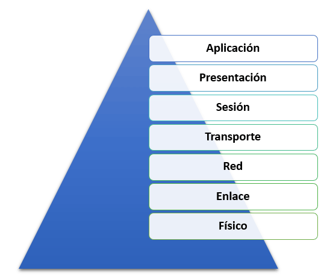

---
**El Modelo OSI**
---

---

---

---
- **Alumno :** Jahir Medina
- **Codigo :** 1012700115
- **Curso :** Comunicacion de Datos
---

---
**DICIEMBRE, 2020**
---

# Introducción

El modelo de referencia ISO/OSI (English Open Systems Interconnection model) es un modelo de referencia para los protocolos de red como arquitectura de capas. La Unión Internacional de Telecomunicaciones (UIT) la ha publicado como norma desde 1983 y la Organización Internacional de Normalización (ISO) desde 1984. Su desarrollo comenzó en 1977.

El propósito del modelo de OSI es describir la comunicación entre los diferentes sistemas técnicos y promover su desarrollo. Para ello, el modelo define siete capas sucesivas, cada una con una tarea estrechamente definida. Los protocolos de red definidos en la misma capa con interfaces claras son fácilmente intercambiables, aunque tengan una función central como el Protocolo de Internet.

Las redes informáticas son el resultado lógico de la evolución de las tecnologías informáticas y de comunicaciones.
Representan un caso particular de los sistemas informáticos distribuidos y pueden considerarse un medio para transmitir información durante mucho tiempo
distancias.

---

> Capas del Modelo OSI
---

# Del Motivo Para Su Creacion

En una red informática, otros anfitriones prestan servicios de diferentes tipos a los diversos clientes. La comunicación necesaria para ello es más complicada de lo que parece a primera vista, ya que hay que realizar una multitud de tareas y cumplir los requisitos de fiabilidad, seguridad, eficiencia, etc. Los problemas a resolver van desde cuestiones de transmisión electrónica de las señales a una secuencia regulada en la comunicación hasta tareas más abstractas que surgen dentro de las aplicaciones de comunicación.

Debido a esta multitud de tareas, se introdujo el modelo OSI, en el que los procesos de comunicación se dividen en siete niveles (también llamados capas). Los requisitos se aplican por separado en cada capa individual.

Las instancias utilizadas deben funcionar según reglas definidas tanto del lado del emisor como del receptor para permitir el procesamiento de los datos. La definición de estas reglas se describe en un registro y forma una conexión lógica y horizontal entre dos instancias de la misma capa.

Cada instancia proporciona servicios que pueden ser utilizados por una instancia directamente superior a ella. Para prestar el servicio, la propia instancia utiliza los servicios de la instancia inmediatamente inferior. Por lo tanto, el flujo real de datos es vertical. Las instancias de una capa son intercambiables si pueden ser intercambiadas tanto en el emisor como en el receptor.

# Capas del Modelo OSI

## Capa 1 - capa de transmisión de bits (capa física)

La capa física es la capa más baja. Esta capa proporciona herramientas mecánicas, eléctricas y otras herramientas funcionales para activar o desactivar conexiones físicas, mantenerlas y transferir bits sobre ellas. Estos pueden ser, por ejemplo, señales eléctricas, señales ópticas (guías de luz, láseres), ondas electromagnéticas (redes inalámbricas) o sonido. Los métodos utilizados para esto se denominan métodos de transmisión. Los dispositivos y componentes de red que se asignan a la capa física son, por ejemplo, la antena y el amplificador, el enchufe y la toma para el cable de red, el repetidor, el concentrador, el transceptor, la pieza en T y el terminador.

En la capa de transferencia de bits, la transferencia de bits digital se lleva a cabo en un enlace de transmisión por cable o inalámbrico. Se puede compartir un medio de transmisión en esta capa mediante multiplexación estática o multiplexación dinámica. Además de las especificaciones de ciertos medios de transmisión (por ejemplo, cables de cobre, fibra óptica, red eléctrica) y la definición de conexiones de enchufe, esto requiere elementos adicionales.

Además, la forma en que debe transmitirse un bit individual debe resolverse en este nivel: en las redes informáticas, la información se transmite en forma de secuencias de bits o símbolos. En los cables de cobre y en la transmisión por radio, las ondas electromagnéticas moduladas de alta frecuencia son los portadores de información, en las fibras ópticas las ondas de luz de una o más longitudes de onda específicas. Dependiendo de la modulación, los portadores de información pueden asumir no solo dos estados para cero y uno, sino posiblemente muchos más. Por lo tanto, debe definirse una codificación para cada tipo de transmisión. Esto se hace con la ayuda de la especificación de la capa física de una red.

- Hardware en esta capa: repetidores, concentradores, cables, conectores, etc. a.
- Protocolos y estándares: V.24, V.28, X.21, RS 232, RS 422, RS 423, RS 499

## Capa 2: capa de enlace de datos

La tarea de la capa de enlace de datos es garantizar una transmisión confiable, es decir, en gran medida libre de errores, y regular el acceso al medio de transmisión, incluida la capa de seguridad de sección, la capa de seguridad de datos, la capa de seguridad de conexión, el nivel de conexión, el nivel de procedimiento. Esto se hace dividiendo el flujo de datos de bits en bloques, también conocidos como tramas, y agregando sumas de verificación como parte de la codificación del canal. De esta manera, los bloques incorrectos pueden ser reconocidos por el receptor y descartados o incluso corregidos; sin embargo, esta capa no proporciona una solicitud renovada de bloques descartados.

Un "control de flujo de datos" permite que un receptor controle dinámicamente la velocidad a la que el otro lado puede enviar bloques. La organización internacional de ingeniería IEEE vio la necesidad de regular el acceso competitivo a un medio de transmisión para redes locales, lo que no está previsto en el modelo OSI.

Según IEEE, la capa 2 se divide en dos subcapas: LLC (control de enlace lógico, capa 2b) y MAC (control de acceso a medios, capa 2a). En una definición anterior de las capas OSI, la capa 2 no contiene muchos componentes de control de acceso a los medios; estas funciones deben ser asumidas por capas OSI superiores allí.

Hardware en esta capa: puente, conmutador (puente multipuerto)

El protocolo Ethernet describe tanto la capa 1 como la capa 2, donde CSMA / CD se utiliza como control de acceso.

- Protocolos y estándares que se basan en otros protocolos y estándares de Capa 2: HDLC, SDLC, DDCMP, IEEE 802.2 (LLC), RLC, PDCP, ARP, RARP, STP, Shortest Path Bridging
- Protocolos y estándares que se basan directamente en la Capa 1: IEEE 802.11 (WLAN), IEEE 802.4 (Token Bus), IEEE 802.5 (Token Ring), FDDI

## Capa 3 - Capa de red

La capa de red (también conocida como nivel de paquetes o capa de red) asegura la conmutación de conexiones en el caso de servicios orientados a la línea y el reenvío de paquetes de datos en el caso de servicios orientados a paquetes, así como la prevención de la congestión. En ambos casos, la transmisión de datos pasa por toda la red de comunicación e incluye la búsqueda de ruta (enrutamiento) entre los nodos de la red. Dado que la comunicación directa entre el remitente y el destino no siempre es posible, los paquetes deben ser reenviados por los nodos en el camino. Los paquetes reenviados no alcanzan las capas superiores, pero se les asigna un nuevo destino intermedio y se envían al siguiente nodo.

Entre las tareas más importantes de la capa de red se encuentran el suministro de direcciones entre redes, el enrutamiento o la creación y actualización de tablas de enrutamiento y la fragmentación de paquetes de datos. Pero también la negociación y la garantía de una cierta calidad de servicio entra en el ámbito de la capa de red.

Además del Protocolo de Internet, las direcciones NSAP también pertenecen a esta capa. Dado que una red de comunicación puede estar formada por varias subredes de diferentes medios y protocolos de transmisión, esta capa también contiene las funciones de conversión necesarias para el reenvío entre las subredes.

- Hardware en esta capa: Router, interruptor de la capa 3 (BRouter).
- Protocolos y normas: X.25, ISO 8208, ISO 8473 (CLNP), ISO 9542 (ESIS), IP, IPsec, ICMP.

## Capa 4 - Capa de transporte

Las tareas de la capa de transporte (también conocidas como control de extremo a extremo, control del transporte) incluyen la segmentación del flujo de datos, la evitación de la congestión y la garantía de una transmisión sin errores.

Un segmento de datos es una unidad de datos de servicio que se utiliza para la encapsulación de datos en la cuarta capa (capa de transporte). Consiste en elementos de protocolo que contienen información de control de la capa 4. Como dirección, al segmento de datos se le asigna una dirección de capa 4, es decir, un puerto. El segmento de datos está encapsulado en un paquete de datos en la capa 3.

La capa de transporte proporciona un acceso uniforme a las capas 5 a 7 orientadas a la aplicación, de modo que no necesitan considerar las propiedades de la red de comunicaciones.

En la capa 4 se definen cinco clases de servicio diferentes de distinta calidad que pueden ser utilizadas por las capas superiores, desde el servicio más simple hasta el más conveniente con mecanismos de multiplexación, protección contra errores y procedimientos de corrección de errores.

- Protocolos y normas: ISO 8073/X.224, ISO 8602, TCP, UDP, SCTP, DCCP.

## Capa 5 - Capa de sesión

La capa 5 (control de las conexiones lógicas; también llamada capa de sesión, capa de comunicación, capa de control de la comunicación) es responsable de la comunicación de procesos entre dos sistemas. Entre otras cosas, el protocolo RPC (Remote Procedure Call) se encuentra aquí. Para resolver las averías de las sesiones y problemas similares, la capa de sesión proporciona servicios para el intercambio organizado y sincronizado de datos. Para ello se introducen puntos de reinicio, los llamados puntos de control, en los que se puede volver a sincronizar la sesión después de que haya fallado una conexión de transporte sin tener que volver a iniciar la transmisión desde el principio.

- Protocolos y normas: ISO 8326 / X.215 (Servicio de sesión), ISO 8327 / X.225 (Protocolo de sesión orientado a la conexión), ISO 9548 (Protocolo de sesión sin conexión)

## Capa 6 - Capa de presentación

La capa de presentación (también conocida como capa de presentación de datos, capa de suministro de datos) convierte la representación de datos dependiente del sistema (por ejemplo, ASCII, EBCDIC) en una forma independiente y permite así el intercambio de datos sintácticamente correctos entre diferentes sistemas. Tareas como la compresión y el cifrado de datos también pertenecen a la capa 6. La capa de presentación garantiza que los datos enviados por la capa de aplicación de un sistema puedan ser leídos por la capa de aplicación de otro sistema. De ser necesario, la capa de presentación actúa como traductora entre los diferentes formatos de datos utilizando un formato de datos que pueda ser comprendido por ambos sistemas, el ASN.1 (Abstract Syntax Notation One).

- Protocolos y normas: ISO 8822 / X.216 (Servicio de presentación), ISO 8823 / X.226 (Protocolo de presentación orientado a la conexión), ISO 9576 (Protocolo de presentación sin conexión)

## Capa 7 - Capa de aplicación

Servicios, aplicaciones y gestión de redes. La capa de aplicación proporciona funciones para las aplicaciones. Esta capa proporciona la conexión con las capas inferiores. La entrada y salida de datos también tiene lugar en esta capa. Las aplicaciones en sí mismas no son parte de la capa.

- Aplicaciones: Navegador web, programa de correo electrónico, mensajería instantánea 

## Tabla Resumen de Protocolos por Capa

# Referencias

1. **"Computer Pioneers - Christopher Strachey"**. history.computer.org. Retrieved 2020-01-23.
1. **"Reminiscences on the Theory of Time-Sharing"**. jmc.stanford.edu. Retrieved 2020-01-23.
1. **"Computer - Time-sharing and minicomputers"**. Encyclopedia Britannica. Retrieved 2020-01-23.
1. **Gillies, James M.; Gillies, James; Gillies, James and Cailliau Robert; Cailliau, R. (2000)**. How the Web was Born: The Story of the World Wide Web. Oxford University Press. pp. 13. ISBN 978-0-19-286207-5.
1. **Chris Sutton. "Internet Began 35 Years Ago at UCLA with First Message Ever Sent Between Two Computers".** UCLA. Archived from the original on 2008-03-08.
1. **Gillies, James; Cailliau, Robert (2000). How the Web was Born: The Story of the World Wide Web.** Oxford University Press. p. 25. ISBN 0192862073.
1. **C. Hempstead; W. Worthington (2005). Encyclopedia of 20th-Century Technology**. Routledge. ISBN 9781135455514.
1. **Bennett, Richard (September 2009). "Designed for Change: End-to-End Arguments, Internet Innovation, and the Net Neutrality Debate" (PDF).** Information Technology and Innovation Foundation. p. 11. Retrieved 2017-09-11.
1. **Robert M. Metcalfe; David R. Boggs (July 1976). "Ethernet: Distributed Packet Switching for Local Computer Networks".** Communications of the ACM. 19 (5): 395–404. doi:10.1145/360248.360253. S2CID 429216. Archived from the original on 2007-08-07.
1. **Redes de Coputadores Locais e de Longa Distância, Autor: Liane M. R.** Tarouco, 1986, Editora McGraw-Hill, ISBN 0-07-450477-0
1. **SOARES, Luiz Fernando Gomes; LEMOS, Guido; Colcher, Sérgio, Redes de Computadores: Das LANs, MANs e WANs às Redes ATM, 2. Ed.** revisada e ampliada, 4 reimpressão, Editora Campus, 1997, p. 10 - 28
1. **MAIA, Luiz Paulo, Arquitetura de Redes de Computadores,** Rio de Janeiro, LTC, 2009, p. 7, 37

