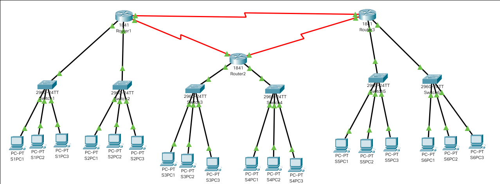

---
**Practica PacketTracer**
---

---

---

---
- **Alumno :** Jahir Medina
- **Codigo :** 1012700115
- **Curso :** Comunicacion de Datos
---

---
**DICIEMBRE, 2020**
---

# Descripcion de la Arquitectura

---

> Modelo de la Red
---

Se crean 6 Switchs , 3 Routers y  18 Computadoras, por cada Switch 3 Computadoras

Los ip por cada trio de computadoras es:

- **GateWay**: 192.168.1.1
	* **S1PC**: 192.168.1.2
	* **S1PC**: 192.168.1.3
	* **S1PC**: 192.168.1.4

- **GateWay**: 192.168.2.1
	* **S2PC**: 192.168.2.2
	* **S2PC**: 192.168.2.3
	* **S2PC**: 192.168.2.4

- **GateWay**: 192.168.3.1
	* **S3PC**: 192.168.3.2
	* **S3PC**: 192.168.3.3
	* **S3PC**: 192.168.3.4

- **GateWay**: 192.168.4.1
	* **S4PC**: 192.168.4.2
	* **S4PC**: 192.168.4.3
	* **S4PC**: 192.168.4.4

- **GateWay**: 192.168.5.1
	* **S5PC**: 192.168.5.2
	* **S5PC**: 192.168.5.3
	* **S5PC**: 192.168.5.4

- **GateWay**: 192.168.6.1
	* **S6PC**: 192.168.6.2
	* **S6PC**: 192.168.6.3
	* **S6PC**: 192.168.6.4

 y por cada Router 2 Switchs
Posteriormente se conecta en anillo los 3 Routers, los comandos por cada Router son:

### Router 1

`Router1(config)# interface FastEthernet0/0`

`Router1(config-if)# ip address 192.168.1.1 255.255.255.0`

`Router1(config-if)# no shutdown`

`Router1(config-if)# exit`

`Router1(config)# interface FastEthernet0/1`

`Router1(config-if)# ip address 192.168.2.1 255.255.255.0`

`Router1(config-if)# no shutdown`

`Router1(config-if)# exit`

---

`Router1(config)# interface Serial0/0/0`

`Router1(config-if)# ip address 168.10.0.1 255.255.255.0`

`Router1(config-if)# exit`

`Router1(config-if)#  no shutdown`

`Router1(config)# interface Serial0/1/0`

`Router1(config-if)# ip address 168.20.0.1 255.255.255.0`

`Router1(config-if)# no shutdown`

`Router1(config-if)# exit`

---

`Router1(config)# ip route 192.168.3.0 255.255.255.0 168.20.0.2`

`Router1(config)# ip route 192.168.4.0 255.255.255.0 168.20.0.2`

`Router1(config)# ip route 192.168.5.0 255.255.255.0 168.10.0.2`

`Router1(config)# ip route 192.168.6.0 255.255.255.0 168.10.0.2`

### Router 2

`Router2(config)# interface FastEthernet0/0`

`Router2(config-if)# ip address 192.168.3.1 255.255.255.0`

`Router2(config-if)# no shutdown`

`Router2(config-if)# exit`

`Router2(config)# interface FastEthernet0/1`

`Router2(config-if)# ip address 192.168.4.1 255.255.255.0`

`Router2(config-if)# no shutdown`

`Router2(config-if)# exit`

---

`Router2(config)# interface Serial0/0/0`

`Router2(config-if)# ip address 168.20.0.2 255.255.255.0`

`Router2(config-if)# no shutdown`

`Router2(config-if)# exit`

`Router2(config)# interface Serial0/1/0`

`Router2(config-if)# ip address 192.30.0.1 255.255.255.0`

`Router2(config-if)# no shutdown`

`Router2(config-if)# exit`

---

`Router2(config)#ip route 192.168.1.0 255.255.255.0 168.20.0.1`

`Router2(config)#ip route 192.168.2.0 255.255.255.0 168.20.0.1`

`Router2(config)#ip route 192.168.5.0 255.255.255.0 168.30.0.2`

`Router2(config)#ip route 192.168.6.0 255.255.255.0 168.30.0.2`

### Router 3

`Router3(config)# interface FastEthernet0/0`

`Router3(config-if)# ip address 192.168.5.1 255.255.255.0`

`Router3(config-if)# no shutdown`

`Router3(config-if)# exit`

`Router3(config)# interface FastEthernet0/1`

`Router3(config-if)# ip address 192.168.6.1 255.255.255.0`

`Router3(config-if)# no shutdown`

`Router3(config-if)# exit`

---

`Router3(config)# interface Serial0/0/0`

`Router3(config-if)# ip address 192.30.0.2 255.255.255.0`

`Router3(config-if)# no shutdown`

`Router3(config-if)# exit`

`Router3(config)# interface Serial0/1/0`

`Router3(config-if)# ip address 192.10.0.2 255.255.255.0`

`Router3(config-if)# no shutdown`

`Router3(config-if)# exit`

---

`Router3(config)#ip route 192.168.1.0 255.255.255.0 168.10.0.1`

`Router3(config)#ip route 192.168.2.0 255.255.255.0 168.10.0.1`

`Router3(config)#ip route 192.168.3.0 255.255.255.0 168.30.0.1`

`Router3(config)#ip route 192.168.4.0 255.255.255.0 168.30.0.1`

