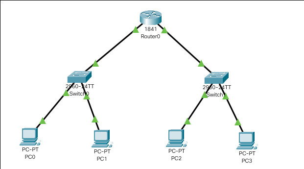
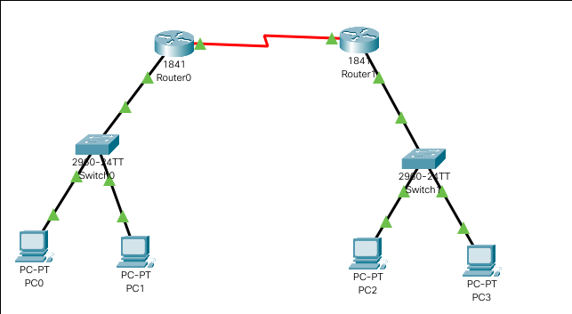
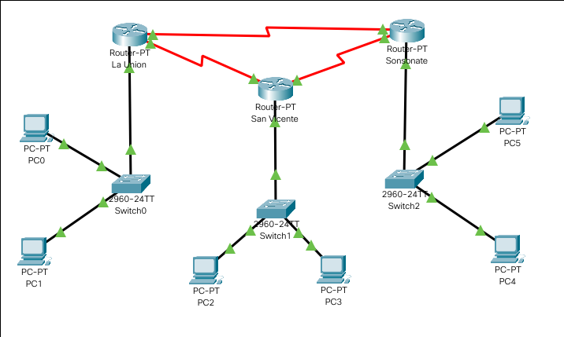

---
**Examen Practico - Unidad 1**
---

---

---

---
- **Alumno :** Jahir Medina
- **Codigo :** 1012700115
- **Curso :** Comunicacion de Datos
---

---
**DICIEMBRE, 2020**
---

# Problema 1

---

> Modelo de la Red
---

- **Gateway** : 172.16.0.1
	* **PC0** : 172.16.0.2
	* **PC1** : 172.16.0.3

- **Gateway** : 10.0.0.1
	* **PC2** : 10.0.0.2
	* **PC3** : 10.0.0.3

## Router 1

---

> `interface FastEthernet0/0`

> `ip address 172.16.0.1 255.255.0.0`

> `ip address 172.16.0.1 255.255.0.0`

> `no shutdown`

> `exit`

---

> `interface FastEthernet0/0`

> `exit`

> `interface FastEthernet0/1`

> `ip address 10.0.0.1 255.0.0.0`

> `ip address 10.0.0.1 255.0.0.0`

> `no shutdown`

---

# Problema 2

---

> Modelo de la Red
---

- **Gateway** : 192.168.0.1
	* **PC0** : 192.168.0.2
	* **PC1** : 192.168.0.3

- **Gateway** : 192.168.1.1
	* **PC2** : 192.168.1.2
	* **PC3** : 192.168.1.3

## Router 1

---

> `interface Serial0/1/0`

> `ip address 10.10.10.1 255.0.0.0`

> `no shutdown`

> `ip address  `

> `exit`

---

> `interface FastEthernet0/0`

> `ip address 192.168.0.1 255.255.255.0`

> `no shutdown`

> `exit`

---

> `ip route 192.168.1.0 255.255.255.0 10.10.10.2`

---

## Router 2

---

> `interface Serial0/0/0`

> `ip address 10.10.10.2 255.0.0.0`

> `no shutdown`

> `ip address  `

> `exit`

---

> `interface FastEthernet0/0`

> `ip address 192.168.1.1 255.255.255.0`

> `no shutdown`

> `exit`

---

> `ip route 192.168.0.0 255.255.255.0 10.10.10.1`

---

# Problema 3

---

> Modelo de la Red
---

- **Gateway** : 192.168.1.1
	* **PC0** : 192.168.1.2
	* **PC1** : 192.168.1.3

- **Gateway** : 172.16.1.1
	* **PC2** : 172.16.1.2
	* **PC3** : 172.16.1.3

- **Gateway** : 10.1.50.1
	* **PC4** : 10.1.50.2
	* **PC5** : 10.1.50.3

## Router 1

---

> `interface FastEthernet0/0`

> `ip address 192.168.1.1 255.255.255.0`

> `no shutdown`

> `exit`

---

> `interface Serial3/0`

> `ip address 200.33.146.1 255.255.255.0`

> `no shutdown`

> `exit`

> `interface Serial2/0`

> `ip address 200.33.145.1 255.255.255.0`

> `no shutdown`

> `exit`

---

> `ip route 10.1.50.0 255.255.255.0 200.33.145.2`

> `ip route 172.16.1.0 255.255.255.0 200.33.146.2`

---

## Router 2

---

> `interface FastEthernet0/0`

> `ip address 172.16.1.1 255.255.0.0`

> `exit`

---

> `interface Serial2/0`

> `ip address 200.33.146.2 255.255.255.0`

> `no shutdown`

> `exit`

> `interface Serial3/0`

> `ip address 200.33.147.1 255.255.255.0`

> `no shutdown`

> `exit`

---

> `ip route 192.168.1.0 255.255.255.0 200.33.146.1`

> `ip route 10.1.50.0 255.255.255.0 200.33.147.2`

---

## Router 3

---

> `interface FastEthernet0/0`

> `ip address 10.1.50.1 255.0.0.0`

> `no shutdown`

> `exit`

---

> `interface Serial2/0`

> `ip address 200.33.147.2 255.255.255.0`

> `no shutdown`

> `exit`

> `interface Serial3/0`

> `ip address 200.33.145.2 255.255.255.0`

> `no shutdown`

> `exit`

---

> `ip route 192.168.1.0 255.255.255.0 200.33.145.1`

> `ip route 172.16.1.0 255.255.255.0 200.33.147.1`

---