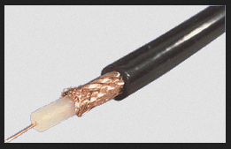
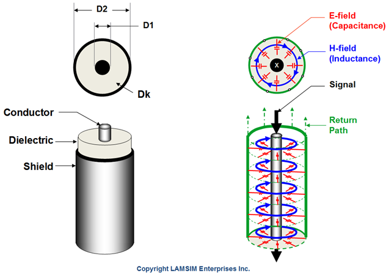
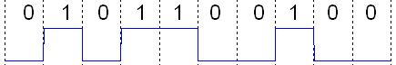
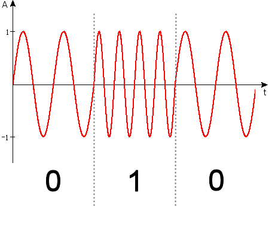
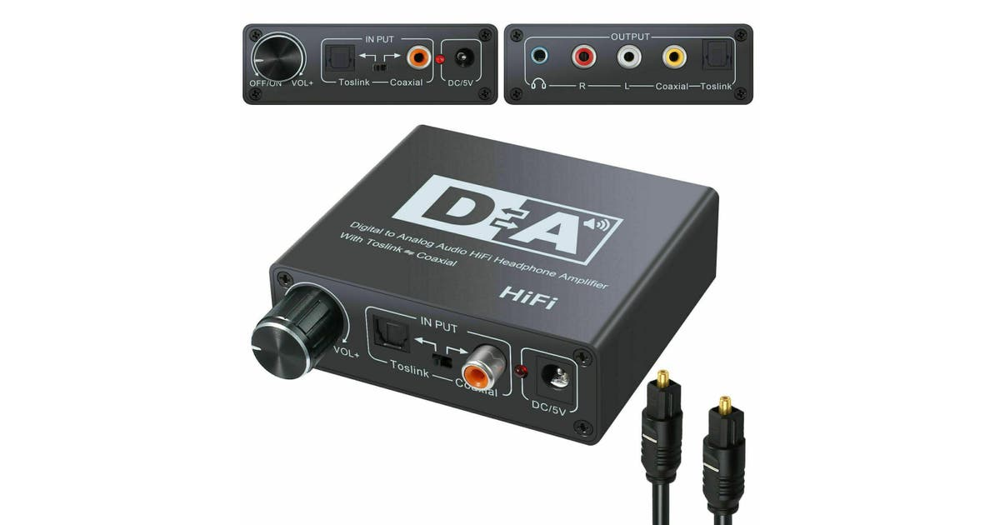
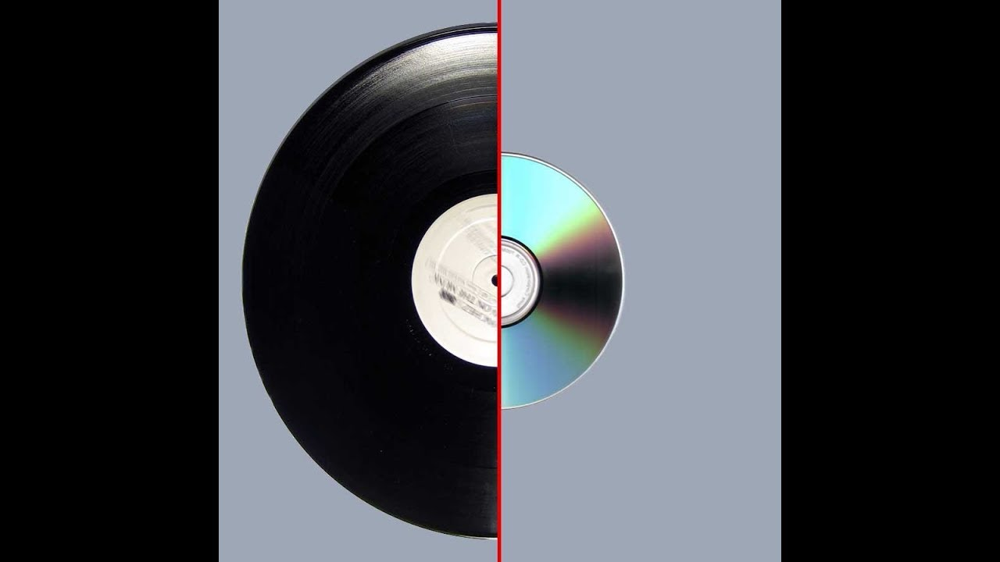

---

---

# Señales Analogicas

Una señal analógica es cualquier señal continua cuya característica de variación temporal es una representación de alguna otra cantidad variable en el tiempo, es decir, análoga a otra señal variable en el tiempo. Por ejemplo, en una señal de audio analógica, el voltaje instantáneo de la señal varía continuamente con la presión de las ondas sonoras.

Se diferencia de una señal digital, en la que la cantidad continua es una representación de una secuencia de valores discretos que sólo puede asumir uno de un número finito de valores.

El término señal analógica suele referirse a las señales eléctricas; sin embargo, los sistemas mecánicos, neumáticos, hidráulicos y de otro tipo también pueden transmitir o considerarse señales analógicas.

---

> Cable Coaxial, Vista Diagonal
---

---

> Cable Coaxial, Vista Funcional
---

Una señal analógica utiliza alguna propiedad del medio para transmitir la información de la señal. Por ejemplo, un barómetro aneroide utiliza la posición de rotación como señal para transmitir información de presión. En una señal eléctrica, el voltaje, la corriente o la frecuencia de la señal pueden variar para representar la información.

Cualquier información puede ser transmitida por una señal analógica; dicha señal puede ser una respuesta medida a los cambios de una variable física, como el sonido, la luz, la temperatura, la posición o la presión. La variable física se convierte en una señal analógica mediante un transductor. Por ejemplo, el sonido que golpea el diafragma de un micrófono induce fluctuaciones correspondientes en la corriente producida por una bobina en un micrófono electromagnético o el voltaje producido por un micrófono de condensador. Se dice que el voltaje o la corriente es un análogo del sonido.

# Señales Digitales

Una señal digital es una señal que se utiliza para representar datos como una secuencia de valores discretos; en un momento dado sólo puede asumir, como máximo, uno de un número finito de valores. Esto contrasta con una señal analógica, que representa valores continuos; en un momento dado representa un número real dentro de un rango continuo de valores.

Las señales digitales simples representan información en bandas discretas de niveles analógicos. Todos los niveles dentro de una banda de valores representan el mismo estado de información. En la mayoría de los circuitos digitales, la señal puede tener dos posibles valores válidos; esto se denomina señal binaria o señal lógica.

Están representados por dos bandas de tensión: una cerca de un valor de referencia (típicamente denominada como tierra o cero voltios), y la otra un valor cerca de la tensión de alimentación. Éstas corresponden a los dos valores "cero" y "uno" (o "falso" y "verdadero") del dominio booleano, por lo que en un momento dado una señal binaria representa un dígito binario (bit).

Debido a esta discretización, los cambios relativamente pequeños en los niveles de la señal analógica no salen de la envolvente discreta, y como resultado son ignorados por los circuitos de detección del estado de la señal. En consecuencia, las señales digitales tienen inmunidad al ruido; el ruido electrónico, siempre que no sea demasiado grande, no afectará a los circuitos digitales, mientras que el ruido siempre degrada en cierta medida el funcionamiento de las señales analógicas.

---

> Señal Digital Binaria
---

Las señales digitales que tienen más de dos estados se utilizan ocasionalmente; los circuitos que utilizan esas señales se denominan lógica multivaluada. Por ejemplo, las señales que pueden asumir tres posibles estados se denominan lógica de tres valores.

En una señal digital, la cantidad física que representa la información puede ser una corriente o voltaje eléctrico variable, la intensidad, fase o polarización de un campo óptico u otro campo electromagnético, la presión acústica, la magnetización de un medio de almacenamiento magnético, etc. Las señales digitales se utilizan en toda la electrónica digital, en particular en el equipo informático y en la transmisión de datos.

# Conversion Analogica a Digital

En las comunicaciones digitales, una señal digital es una señal física en tiempo continuo, que alterna entre un número discreto de formas de onda, representando un flujo de bits. La forma de la forma de onda depende del esquema de transmisión, que puede ser un esquema de codificación en línea que permite la transmisión en banda base; o un esquema de modulación digital, que permite la transmisión en banda base a través de cables largos o en una banda de radiofrecuencia limitada. Esa onda sinusoidal modulada por la portadora se considera una señal digital en la literatura sobre comunicaciones digitales y transmisión de datos, pero se considera una corriente de bits convertida en una señal analógica en la electrónica y las redes informáticas.

---

> Conversion de Señal FM a Binario
---

En las comunicaciones, las fuentes de interferencia suelen estar presentes, y el ruido suele ser un problema importante. Los efectos de la interferencia suelen reducirse al mínimo filtrando las señales que la interfieren en la medida de lo posible y utilizando la redundancia de datos. A menudo se considera que las principales ventajas de las señales digitales para las comunicaciones son la capacidad de inmunidad al ruido y la capacidad, en muchos casos, como en el de los datos de audio y vídeo, de utilizar la compresión de datos para reducir en gran medida el ancho de banda necesario en los medios de comunicación.

# Conversion Digital a Analogica

Una señal se registra digitalmente mediante un convertidor analógico-digital, que mide la amplitud de una señal analógica a intervalos regulares especificados por la frecuencia de muestreo, y luego almacena estos números muestreados en el hardware de la computadora. El problema fundamental de los números en las computadoras es que el rango de valores que pueden ser representados es finito, lo que significa que durante el muestreo, la amplitud de la señal de audio debe ser redondeada a la representación más cercana. Este proceso se denomina cuantificación, y estos pequeños errores en las mediciones se manifiestan fonéticamente como ruido o distorsión de bajo nivel. Esta forma de distorsión, a veces llamada distorsión granular o de cuantificación, ha sido señalada como un fallo de algunos sistemas y grabaciones digitales, en particular de algunas grabaciones digitales tempranas, en las que se decía que la versión digital era inferior a la analógica.

---

> Conversor Digital a Analogico de Alta Resolucion
---

La gama de posibles valores que puede representar numéricamente una muestra está determinada por el número de dígitos binarios utilizados. A esto se le llama la resolución, y se suele denominar la profundidad de bits en el contexto del audio PCM. El nivel de ruido de cuantificación se determina directamente por este número, disminuyendo exponencialmente (linealmente en unidades de dB) a medida que aumenta la resolución. Con una profundidad de bits adecuada, el ruido aleatorio de otras fuentes dominará y enmascarará completamente el ruido de cuantificación. El estándar del CD Redbook utiliza 16 bits, lo que mantiene el ruido de cuantificación 96 dB por debajo de la amplitud máxima, muy por debajo de un nivel discernible con casi cualquier material de fuente. El DVD-Audio y el equipo de grabación profesional más moderno permite muestras de 24 bits.

Los sistemas analógicos no tienen necesariamente niveles digitales discretos en los que la señal esté codificada. Por consiguiente, la señal original puede conservarse con una precisión limitada únicamente por el nivel de ruido intrínseco y el nivel máximo de la señal del medio y del equipo de reproducción, es decir, el rango dinámico del sistema.

# Analogico vs Digital

Como ejemplo principal, el sonido puede ser grabado y almacenado y reproducido usando técnicas digitales o analógicas. Ambas técnicas introducen errores y distorsiones en el sonido, y estos métodos pueden ser comparados sistemáticamente. Los músicos y los oyentes han discutido sobre la superioridad de las grabaciones de sonido digitales frente a las analógicas. Los argumentos a favor de los sistemas analógicos incluyen la ausencia de mecanismos de error fundamentales que están presentes en los sistemas de audio digital, incluyendo el ruido de aliasing y cuantificación. Los defensores de lo digital señalan los altos niveles de rendimiento posibles con el audio digital, incluyendo una excelente linealidad en la banda audible y bajos niveles de ruido y distorsión.

---

> Vinil vs CD
---

Dos diferencias prominentes en el rendimiento entre los dos métodos son el ancho de banda y la relación señal/ruido (relación S/N). El ancho de banda del sistema digital se determina, según la frecuencia de Nyquist, por la frecuencia de muestreo utilizada. El ancho de banda de un sistema analógico depende de las capacidades físicas de los circuitos analógicos. La relación S/N de un sistema digital puede estar limitada por la profundidad de bits del proceso de digitalización, pero la implementación electrónica de los circuitos de conversión introduce un ruido adicional. En un sistema analógico, existen otras fuentes naturales de ruido analógico, como el ruido de parpadeo y las imperfecciones del medio de grabación. Otras diferencias de rendimiento son específicas de los sistemas comparados, como la capacidad de los algoritmos de filtrado más transparentes en los sistemas digitales y la saturación armónica y las variaciones de velocidad de los sistemas analógicos.

|                        |                                                                                                                              Analógico |                                                                                                                                                        Digital |
|------------------------|---------------------------------------------------------------------------------------------------------------------------------------:|---------------------------------------------------------------------------------------------------------------------------------------------------------------:|
| Señal                  |                                                        La señal analógica es una señal continua que representa las mediciones físicas. |                                                                       Las señales digitales son señales temporales discretas generadas por modulación digital. |
| Ondas                  |                                                                                                     Denominadas por ondas sinusoidales |                                                                                                                                Denominadas por ondas cuadradas |
| Representación         |                                                                   Utiliza un rango continuo de valores para representar la información |                                                                                       Utiliza valores discretos o discontinuos para representar la información |
| Ejemplo                |                                                                           Voz humana en el aire, dispositivos electrónicos analógicos. |                                                                                           Computadoras, CDs, DVDs y otros dispositivos electrónicos digitales. |
| Tecnología             |                                                                      La tecnología analógica registra las formas de onda tal como son. |                                                                  Toma muestras de formas de onda analógicas en un conjunto limitado de números y las registra. |
| Transmisiones de datos |                                                Sometidas a deterioro por ruido durante la transmisión y el ciclo de escritura/lectura. |                                                              Pueden ser inmunes al ruido sin deterioro durante la transmisión y el ciclo de escritura/lectura. |
| Respuesta al ruido     |                                                                            Es más probable que se vea afectada reduciendo la precisión |                                                                                     Se ve menos afectada ya que la respuesta al ruido es de naturaleza análoga |
| Flexibilidad           |                                                                                                  El hardware analógico no es flexible. |                                                                                                          El hardware digital es flexible en la implementación. |
| Usos                   |                                   Sólo puede utilizarse en dispositivos analógicos. Se adapta mejor a la transmisión de audio y vídeo. |                                                                                                     Se adapta mejor a la informática y la electrónica digital. |
| Aplicaciones           |                                                                                                                             Termómetro |                                                                                                                                                        PC, PDA |
| Ancho de banda         |                                    El procesamiento de la señal analógica puede hacerse en tiempo real y consume menos ancho de banda. | No hay garantía de que el procesamiento de la señal digital pueda hacerse en tiempo real y consuma más ancho de banda para llevar a cabo la misma información. |
| Memoria                |                                                                                                   Almacenado en forma de señal de onda |                                                                                                                             Almacenado en forma de bit binario |
| Potencia               |                                                                                         El instrumento analógico consume gran potencia |                                                                                                     El instrumento digital consume una potencia insignificante |
| Costo                  |                                                                                                                  Bajo costo y portátil |                                                                                                                   El costo es alto y no es fácilmente portátil |
| Impedancia             |                                                                                                                                   Baja |                                                                                                                               Alta del orden de 100 megaohmios |
| Errores                | Los instrumentos analógicos suelen tener una escala que se estrecha en el extremo inferior y dan considerables errores de observación. |                                              Los instrumentos digitales están libres de errores de observación como los errores de paralaje y de aproximación. |

