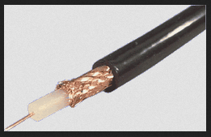

---

---

# Introduccion

Un medio de transmisión es algo que puede mediar en la propagación de señales con fines de telecomunicaciones.

Las señales se imponen típicamente en una onda de algún tipo adecuado para el medio elegido. Por ejemplo, los datos pueden modular el sonido y un medio de transmisión de sonidos puede ser el aire, pero los sólidos y líquidos también pueden actuar como medio de transmisión. El vacío o el aire constituyen un buen medio de transmisión de ondas electromagnéticas como la luz y las ondas de radio. Si bien no se requiere sustancia material para que se propaguen las ondas electromagnéticas, dichas ondas suelen verse afectadas por los medios de transmisión por los que pasan, por ejemplo, por absorción o por reflexión o refracción en las interfaces entre los medios. Por tanto, se pueden emplear dispositivos técnicos para transmitir o guiar ondas. Por tanto, se utiliza como medio de transmisión una fibra óptica o un cable de cobre.

La radiación electromagnética se puede transmitir a través de un medio óptico, como fibra óptica, o mediante cables de par trenzado, cable coaxial o guías de ondas de placa dieléctrica. También puede atravesar cualquier material físico que sea transparente a la longitud de onda específica, como agua, aire, vidrio u hormigón. El sonido es, por definición, la vibración de la materia, por lo que requiere un medio físico para su transmisión, al igual que otros tipos de ondas mecánicas y energía térmica. Históricamente, la ciencia incorporó varias teorías del éter para explicar el medio de transmisión. Sin embargo, ahora se sabe que las ondas electromagnéticas no requieren un medio de transmisión físico, por lo que pueden viajar a través del "vacío" del espacio libre. Las regiones del vacío aislante pueden volverse conductoras para la conducción eléctrica a través de la presencia de electrones, huecos o iones libres.

# Tipos de Medio

En general, un medio de transmisión se puede clasificar como:

- Medio lineal
    * si se pueden superponer diferentes ondas en cualquier punto particular del medio;
- Medio acotado
    * si es finito en extensión, en caso contrario medio ilimitado;
- Medio uniforme o medio homogéneo
    * si sus propiedades físicas no cambian en diferentes puntos;
- Medio isotrópico
    * si sus propiedades físicas son las mismas en diferentes direcciones.

Hay dos tipos principales de medios de transmisión:

- Guiado
- Sin guía

Para fines de telecomunicaciones en los Estados Unidos, el estándar federal 1037C, los medios de transmisión se clasifican como uno de los siguientes:

- Guiado (o acotado)
    * las ondas son guiadas a lo largo de un medio sólido como una línea de transmisión.
- Inalámbrico (o no guiado)
    * La transmisión y la recepción se realizan mediante una antena.

# Símplex versus dúplex

Una transmisión puede ser simple, semidúplex o dúplex completo.

En la transmisión simplex, las señales se transmiten en una sola dirección; una estación es un transmisor y la otra es el receptor. En la operación semidúplex, ambas estaciones pueden transmitir, pero solo una a la vez. En funcionamiento full duplex, ambas estaciones pueden transmitir simultáneamente. En el último caso, el medio transporta señales en ambas direcciones al mismo tiempo.

# Medios Guiados

También se conoce como medio de transmisión por cable que requiere un cable para transferir datos a través de la red.

## Par trenzado

El cableado de par trenzado es un tipo de cableado en el que dos conductores de un solo circuito se trenzan juntos con el fin de mejorar la compatibilidad electromagnética. En comparación con un solo conductor o un par equilibrado no trenzado, un par trenzado reduce la radiación electromagnética del par y la diafonía entre pares vecinos y mejora el rechazo de interferencias electromagnéticas externas. Fue inventado por Alexander Graham Bell.

## Cable coaxial

El cable coaxial es un tipo de cable eléctrico que tiene un conductor interno rodeado por una capa aislante tubular, rodeado por un blindaje conductor tubular. Muchos cables coaxiales también tienen una funda o chaqueta exterior aislante. El término coaxial proviene del conductor interno y el blindaje externo que comparten un eje geométrico. El cable coaxial fue inventado por el físico, ingeniero y matemático inglés Oliver Heaviside, quien patentó el diseño en 1880.

El cable coaxial es un tipo de línea de transmisión que se utiliza para transportar señales eléctricas de alta frecuencia con bajas pérdidas. Se utiliza en aplicaciones tales como líneas troncales telefónicas, cables de red de Internet de banda ancha, buses de datos de computadora de alta velocidad, transmisión de señales de televisión por cable y conexión de transmisores y receptores de radio a sus antenas. Se diferencia de otros cables blindados porque las dimensiones del cable y los conectores se controlan para proporcionar un espaciado de conductores preciso y constante, que es necesario para que funcione de manera eficiente como una línea de transmisión.

---

> Cable Coaxial
---

## Fibra óptica

Otro ejemplo de medio físico es la fibra óptica, que se ha convertido en el medio de transmisión más utilizado para las comunicaciones de larga distancia. La fibra óptica es una fina hebra de vidrio que guía la luz a lo largo de su longitud. Cuatro factores principales favorecen la fibra óptica sobre el cobre: ​​velocidades de datos, distancia, instalación y costos. La fibra óptica puede transportar grandes cantidades de datos en comparación con el cobre. Puede ejecutarse durante cientos de millas sin la necesidad de repetidores de señal, lo que a su vez reduce los costos de mantenimiento y mejora la confiabilidad del sistema de comunicación porque los repetidores son una fuente común de fallas en la red. El vidrio es más liviano que el cobre, lo que permite una menor necesidad de equipo especializado para levantar objetos pesados ​​al instalar fibra óptica de larga distancia. La fibra óptica para aplicaciones en interiores cuesta aproximadamente un dólar por pie, lo mismo que el cobre.

Multimodo y monomodo son dos tipos de fibra óptica de uso común. La fibra multimodo utiliza LED como fuente de luz y puede transportar señales a distancias más cortas, aproximadamente 2 kilómetros. El modo único puede transportar señales a distancias de decenas de millas.

Una fibra óptica es una fibra transparente y flexible hecha de vidrio (sílice) o plástico con un diámetro ligeramente más grueso que el de un cabello humano. Las fibras ópticas se utilizan con mayor frecuencia como un medio para transmitir luz entre los dos extremos de la fibra y encuentran un amplio uso en las comunicaciones de fibra óptica, donde permiten la transmisión a distancias más largas y a anchos de banda más altos (velocidades de datos) que los cables eléctricos. Se utilizan fibras en lugar de cables metálicos porque las señales viajan a lo largo de ellas con menos pérdida; Además, las fibras son inmunes a las interferencias electromagnéticas, un problema que sufren excesivamente los cables metálicos. Las fibras también se utilizan para la iluminación y la formación de imágenes, y a menudo se envuelven en haces para que puedan utilizarse para transportar luz o imágenes fuera de espacios confinados, como en el caso de un fibroscopio. Las fibras especialmente diseñadas también se utilizan para una variedad de otras aplicaciones, algunas de las cuales son sensores de fibra óptica y láseres de fibra.

Las fibras ópticas incluyen típicamente un núcleo rodeado por un material de revestimiento transparente con un índice de refracción más bajo. La luz se mantiene en el núcleo por el fenómeno de la reflexión interna total que hace que la fibra actúe como guía de ondas. Las fibras que admiten muchas rutas de propagación o modos transversales se denominan fibras multimodo, mientras que las que admiten un modo único se denominan fibras monomodo (SMF). Las fibras multimodo generalmente tienen un diámetro de núcleo más amplio y se utilizan para enlaces de comunicación de corta distancia y para aplicaciones donde se debe transmitir alta potencia. Las fibras monomodo se utilizan para la mayoría de los enlaces de comunicación de más de 1000 metros (3300 pies ).

Ser capaz de unir fibras ópticas con baja pérdida es importante en la comunicación por fibra óptica. Esto es más complejo que unir alambres o cables eléctricos e implica un corte cuidadoso de las fibras, una alineación precisa de los núcleos de las fibras y el acoplamiento de estos núcleos alineados. Para aplicaciones que exigen una conexión permanente, es común un empalme por fusión. En esta técnica, se utiliza un arco eléctrico para fundir los extremos de las fibras. Otra técnica común es un empalme mecánico, donde los extremos de las fibras se mantienen en contacto por fuerza mecánica. Las conexiones temporales o semipermanentes se realizan mediante conectores de fibra óptica especializados.

# Medios No Guiados

## Ondas de Radio

La propagación de radio es el comportamiento de las ondas de radio a medida que viajan, o se propagan, de un punto a otro, o en varias partes de la atmósfera. Como forma de radiación electromagnética, como las ondas de luz, las ondas de radio se ven afectadas por los fenómenos de reflexión, refracción, difracción, absorción, polarización y dispersión. Comprender los efectos de las diferentes condiciones en la propagación de radio tiene muchas aplicaciones prácticas, desde la elección de frecuencias para las emisoras internacionales de onda corta, el diseño de sistemas de telefonía móvil fiables, la navegación por radio y el funcionamiento de sistemas de radar.

En los sistemas prácticos de transmisión por radio se utilizan varios tipos diferentes de propagación. Propagación con visibilidad directa: ondas de radio que viajan en línea recta desde la antena transmisora ​​a la antena receptora. La transmisión de línea de visión se utiliza para la transmisión de radio de rango medio, como teléfonos celulares, teléfonos inalámbricos, walkie-talkies, redes inalámbricas, radiodifusión de radio y televisión FM y radar, y comunicación por satélite, como la televisión por satélite. La transmisión de la línea de visión en la superficie de la Tierra se limita a la distancia al horizonte visual, que depende de la altura de las antenas transmisoras y receptoras. Es el único método de propagación posible a frecuencias de microondas y superiores. A frecuencias de microondas, la humedad de la atmósfera (atenuación por lluvia) puede degradar la transmisión.

---

> Fibra Optica, Vista en Funcionamiento
---

A frecuencias más bajas en las bandas de MF, LF y VLF, debido a la difracción, las ondas de radio pueden doblarse sobre obstáculos como colinas y viajar más allá del horizonte como ondas superficiales que siguen el contorno de la Tierra. Estos se denominan ondas terrestres. Las estaciones de radiodifusión AM utilizan ondas terrestres para cubrir sus áreas de escucha. A medida que la frecuencia disminuye, la atenuación con la distancia disminuye, por lo que las ondas terrestres de muy baja frecuencia (VLF) y de frecuencia extremadamente baja (ELF) se pueden utilizar para comunicarse en todo el mundo. Las ondas VLF y ELF pueden penetrar distancias significativas a través del agua y la tierra, y estas frecuencias se utilizan para la comunicación de minas y la comunicación militar con submarinos sumergidos.

A frecuencias de onda media y onda corta (bandas de MF y HF), las ondas de radio pueden refractarse de una capa de partículas cargadas (iones) en lo alto de la atmósfera, llamada ionosfera. Esto significa que las ondas de radio transmitidas en ángulo hacia el cielo pueden reflejarse hacia la Tierra más allá del horizonte, a grandes distancias, incluso a distancias transcontinentales. Esto se llama propagación de ondas celestes. Es utilizado por operadores de radioaficionados para hablar con otros países y estaciones de transmisión de onda corta que transmiten internacionalmente. La comunicación de la onda del cielo es variable, dependiendo de las condiciones en la atmósfera superior; es más confiable por la noche y en invierno. Debido a su falta de confiabilidad, desde la llegada de los satélites de comunicación en la década de 1960, muchas necesidades de comunicación de largo alcance que antes usaban ondas del cielo ahora usan satélites.

### Radio enlaces de VHF y UHF

Estas bandas cubren aproximadamente desde 55 a 550 Mhz. Son también omnidireccionales, pero a diferencia de las anteriores la ionosfera es transparente a ellas. Su alcance máximo es de un centenar de kilómetros, y las velocidades que permite del orden de los 9600 bps. Su aplicación suele estar relacionada con los radioaficionados y con equipos de comunicación militares, también la televisión y los aviones.

### Microondas

Además de su aplicación en hornos, las microondas nos permiten transmisiones tanto terrestres como con satélites. Dada su frecuencias, del orden de 1 a 10 Ghz, las microondas son muy direccionales y sólo se pueden emplear en situaciones en que existe una línea visual que une emisor y receptor. Los enlaces de microondas permiten grandes velocidades de transmisión, del orden de 10 Mbps.

## Satelite

Conocidas como microondas por satélite, esta basado en la comunicación llevada a cabo a través de estos dispositivos, los cuales después de ser lanzados de la tierra y ubicarse en la orbita terrestre siguiendo las leyes descubiertas por Kepler, realizan la transmisión de todo tipo de datos, imágenes, etc., según el fin con que se han creado. Las microondas por satélite manejan un ancho de banda entre los 3 y los 30 Ghz, y son usados para sistemas de televisión, transmisión telefónica a larga distancia y punto a punto y redes privadas punto a punto. Las microondas por satélite, o mejor, el satélite en si no procesan información sino que actúa como un repetidor-amplificador y puede cubrir un amplio espacio de espectro terrestre

---

> Vehiculo con comunicación satelital
---
