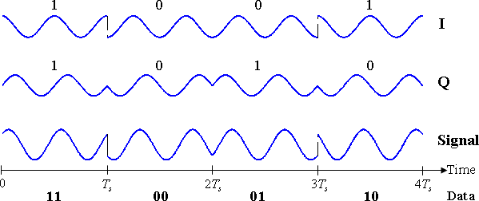

---

---

# Introduccion

La transmisión analógica es un método de transmisión de información mediante una señal continua que varía en amplitud, fase o alguna otra propiedad en proporción a esa información. Puede ser la transferencia de una señal de origen analógica, utilizando un método de modulación analógica como la modulación de frecuencia (FM) o la modulación de amplitud (AM), o sin modulación alguna.

Algunos libros de texto también consideran que la transmisión de datos en banda pasante utilizando un método de modulación digital como ASK, PSK y QAM, es decir, una onda sinusoidal modulada por un flujo de bits digital, es una transmisión analógica y una señal analógica. Otros lo definen como transmisión digital y como señal digital. La transmisión de datos en banda base mediante códigos de línea, que dan lugar a un tren de pulsos, se considera siempre como transmisión digital, aunque la señal de origen pueda ser una señal analógica digitalizada.

# Tipos de Transmisión Analogica

Las señales analógicas suelen especificarse como una tensión que varía de forma continua en el tiempo y que puede visualizarse en un dispositivo conocido como osciloscopio. El desplazamiento máximo de la tensión de una señal analógica periódica (repetitiva) se denomina amplitud, y la distancia más corta entre las crestas de una onda analógica periódica se denomina longitud de onda.

la mayoría de las transmisiones analógicas pertenecen a una de varias categorías. La telefonía y la comunicación de voz eran originalmente de naturaleza analógica, al igual que la mayoría de las transmisiones de televisión y radio. Los primeros dispositivos de telecomunicaciones utilizaban dispositivos de conversión analógica-digital llamados moduladores/demoduladores, o módems, para convertir las señales analógicas en digitales y viceversa.

# Beneficios y Detrimentos

El método de transmisión analógica sigue siendo muy popular, en particular para las distancias más cortas, debido a que los costes son significativamente más bajos y los complejos equipos de multiplexación y temporización son innecesarios, y en los pequeños sistemas de "corta distancia" que simplemente no necesitan la transmisión digital multiplexada.

Sin embargo, en situaciones en las que la señal suele tener una elevada relación señal/ruido y no se puede alcanzar la linealidad de la fuente, o en sistemas de larga distancia y alto rendimiento, lo analógico resulta poco atractivo debido a los problemas de atenuación. Además, a medida que las técnicas digitales se van perfeccionando, los sistemas analógicos se convierten cada vez más en equipos heredados.

Recientemente, algunos países, como los Países Bajos, han cesado por completo las transmisiones analógicas (apagón analógico) en ciertos medios, como la televisión, con el fin de que el gobierno ahorre dinero.

# Conversion Digital-Analogica

Conversión de digital a analógico
Cuando los datos de un ordenador se envían a otro a través de alguna portadora analógica, primero se convierten en señales analógicas. Las señales analógicas se modifican para reflejar los datos digitales, es decir, los datos binarios. Una señal analógica se caracteriza por su amplitud, frecuencia y fase. Hay tres tipos de conversiones de digital a analógico posibles:

- **Modulacion por desplazamiento de la Amplitud**: En esta técnica de conversión, la amplitud de la señal portadora analógica se modifica para reflejar los datos binarios.
- **Modulacion por desplazamiento de la frecuencia**: En esta técnica de conversión, la frecuencia de la señal portadora analógica se modifica para reflejar los datos binarios.
- **Modulacion por desplazamiento de la fase**: En este esquema de conversión, la fase de la señal portadora original se modifica para reflejar los datos binarios.

## Modulacion por desplazamiento de la Amplitud

La modulación por desplazamiento de amplitud (ASK) es una forma de modulación de amplitud que representa los datos digitales como variaciones en la amplitud de una onda portadora. En un sistema ASK, el símbolo binario d-amplitud de la onda portadora y la frecuencia fija para una duración de bit de T segundos. Si el valor de la señal es 1, se transmitirá la señal portadora; en caso contrario, se transmitirá un valor de señal 0.

Cualquier esquema de modulación digital utiliza un número finito de señales distintas para representar los datos digitales. ASK utiliza un número finito de amplitudes, cada una de las cuales tiene asignado un patrón único de dígitos binarios. Normalmente, cada amplitud codifica un número igual de bits. Cada patrón de bits forma el símbolo que representa la amplitud en cuestión. El demodulador, diseñado específicamente para el conjunto de símbolos utilizado por el modulador, determina la amplitud de la señal recibida y la mapea de nuevo al símbolo que representa, recuperando así los datos originales. La frecuencia y la fase de la portadora se mantienen constantes.

Al igual que la AM, la ASK también es lineal y sensible al ruido atmosférico, a las distorsiones, a las condiciones de propagación en las diferentes rutas de la RTC, etc. Tanto los procesos de modulación como de demodulación ASK son relativamente baratos. La técnica ASK también se utiliza habitualmente para transmitir datos digitales por fibra óptica. En los transmisores LED, el 1 binario se representa con un breve pulso de luz y el 0 binario con la ausencia de luz. Los transmisores láser suelen tener una corriente de "polarización" fija que hace que el dispositivo emita un nivel de luz bajo. Este nivel bajo representa el 0 binario, mientras que una onda luminosa de mayor amplitud representa el 1 binario.

La forma más sencilla y común de ASK funciona como un interruptor, utilizando la presencia de una onda portadora para indicar un uno binario y su ausencia para indicar un cero binario. Este tipo de modulación se denomina on-off keying (OOK), y se utiliza en las frecuencias de radio para transmitir el código Morse (denominado operación de onda continua),

Se han desarrollado esquemas de codificación más sofisticados que representan los datos en grupos utilizando niveles de amplitud adicionales. Por ejemplo, un esquema de codificación de cuatro niveles puede representar dos bits con cada desplazamiento de amplitud; un esquema de ocho niveles puede representar tres bits; y así sucesivamente. Estas formas de codificación por desplazamiento de amplitud requieren una elevada relación señal/ruido para su recuperación, ya que por su naturaleza gran parte de la señal se transmite a potencia reducida.

---

> Diagrama de Bloques del proceso de conversion. 
---

## Modulación por desplazamiento de la Frecuencia

La modulación por desplazamiento de frecuencia (FSK) es un esquema de modulación de frecuencia en el que la información digital se transmite a través de cambios discretos de frecuencia de una señal portadora. Esta tecnología se utiliza en sistemas de comunicación como la telemetría, las radiosondas de los globos meteorológicos, el identificador de llamadas, los abridores de puertas de garaje y la transmisión de radio de baja frecuencia en las bandas VLF y ELF. La FSK más sencilla es la FSK binaria (BFSK). BFSK utiliza un par de frecuencias discretas para transmitir información binaria (0s y 1s). En este esquema, el 1 se denomina frecuencia de marca y el 0, frecuencia espacial.

---

> Visualizacion de Modulacion por desplazamiento de la frecuencia
---

## Modulación por desplazamiento de la Fase

La modulación por desplazamiento de fase (PSK) es un proceso de modulación digital que transmite datos cambiando (modulando) la fase de una señal de referencia de frecuencia constante (la onda portadora). La modulación se consigue variando las entradas de seno y coseno en un momento preciso. Se utiliza mucho en las redes LAN inalámbricas, la RFID y la comunicación Bluetooth.

Cualquier esquema de modulación digital utiliza un número finito de señales distintas para representar los datos digitales. PSK utiliza un número finito de fases, cada una de las cuales tiene asignado un patrón único de dígitos binarios. Normalmente, cada fase codifica un número igual de bits. Cada patrón de bits forma el símbolo que representa la fase en cuestión. El demodulador, diseñado específicamente para el conjunto de símbolos utilizado por el modulador, determina la fase de la señal recibida y la mapea de nuevo al símbolo que representa, recuperando así los datos originales. Para ello, el receptor debe ser capaz de comparar la fase de la señal recibida con una señal de referencia; este sistema se denomina coherente (y se conoce como CPSK).

El sistema CPSK requiere un demodulador complicado, ya que debe extraer la onda de referencia de la señal recibida y seguirla, para comparar cada muestra con ella. Como alternativa, se puede medir el desplazamiento de fase de cada símbolo enviado con respecto a la fase del símbolo anterior enviado. Como los símbolos se codifican en la diferencia de fase entre las muestras sucesivas, esto se denomina codificación diferencial por desplazamiento de fase (DPSK). La DPSK puede ser mucho más sencilla de implementar que la PSK ordinaria, ya que es un esquema "no coherente", es decir, no es necesario que el demodulador siga una onda de referencia. La contrapartida es que tiene más errores de demodulación.

---

> Visualizacion de la modulación por desplazamiento de fase
---

# Conversion Analogica-Analogica

La conversión analógica-analógica, o modulación, es la representación de la información analógica mediante una señal analógica. Es un proceso en virtud del cual una característica de la onda portadora varía en función de la amplitud instantánea de la señal moduladora. Esta modulación suele ser necesaria cuando se requiere un canal de paso de banda. El paso de banda es un rango de frecuencias que se transmiten a través de un filtro de paso de banda que es un filtro que permite el paso de frecuencias específicas impidiendo las señales en frecuencias no deseadas.

La conversión de analógico a analógico puede hacerse de tres maneras:

- **Modulación de amplitud**
- **Modulación de frecuencia**
- **Modulación de fase**

## Modulación de Amplitud 

Es la modulación en la que la amplitud de la onda portadora varía en función de la amplitud instantánea de la señal moduladora manteniendo la fase y la frecuencia como constantes. La figura siguiente muestra el concepto de modulación de amplitud:

---

> Amplitud Modulada
---

La AM se implementa normalmente utilizando un simple multiplicador, ya que la amplitud de la señal portadora debe modificarse en función de la amplitud de la señal moduladora.

- Ancho de banda de AM:
    * La modulación crea un ancho de banda que es el doble del ancho de banda de la señal moduladora y cubre un rango centrado en la frecuencia de la portadora.

## Modulacion de Frecuencia

La modulación en la que la frecuencia de la onda portadora varía en función de la amplitud instantánea de la señal moduladora manteniendo la fase y la amplitud como constantes. La figura siguiente muestra el concepto de modulación de frecuencia:

---

> Frecuencia Modulada
---

La FM se implementa normalmente utilizando un oscilador controlado por tensión, como en el caso de la FSK. La frecuencia del oscilador cambia en función de la tensión de entrada, que es la amplitud de la señal moduladora.

- Ancho de banda de FM:
    * El ancho de banda de una señal de frecuencia modulada varía con la desviación y la frecuencia de modulación.
Si la frecuencia de modulación (Mf) es de 0,5, la señal Fm es de banda ancha.
    * Para una señal Fm de banda estrecha, el ancho de banda requerido es el doble de la frecuencia máxima de la modulación, sin embargo, para una señal Fm de banda ancha el ancho de banda requerido puede ser mucho mayor, con bandas laterales detectables que se extienden por grandes cantidades del espectro de frecuencias.

## Modulacion de Fase

Es la modulación en la que la fase de la onda portadora varía en función de la amplitud instantánea de la señal moduladora manteniendo la amplitud y la frecuencia como constantes. La figura siguiente muestra el concepto de modulación de frecuencia:

---

> Fase Modulada
---

La modulación de fase es prácticamente similar a la modulación de frecuencia, pero en la modulación de fase no se aumenta la frecuencia de la señal portadora. Normalmente se implementa utilizando un oscilador controlado por tensión junto con una derivada. La frecuencia del oscilador cambia en función de la derivada de la tensión de entrada, que es la amplitud de la señal moduladora.

- Ancho de banda de la PM:

    * Para señales de pequeña amplitud, la PM es similar a la modulación de amplitud (AM) y presenta su desafortunada duplicación del ancho de banda de la banda base y su escasa eficiencia.
    * Para una señal sinusoidal grande, PM es similar a FM, y su ancho de banda es aproximadamente, 2 (h+1) Fm donde h= índice de modulación.

Por lo tanto, la modulación nos permite enviar una señal en un rango de frecuencias de paso de banda. Si cada señal tiene su propio rango de frecuencias, entonces podemos transmitir múltiples señales simultáneamente por un solo canal, todas ellas utilizando diferentes rangos de frecuencia.

