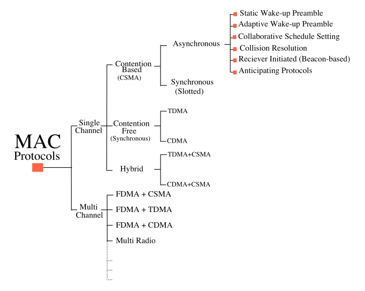
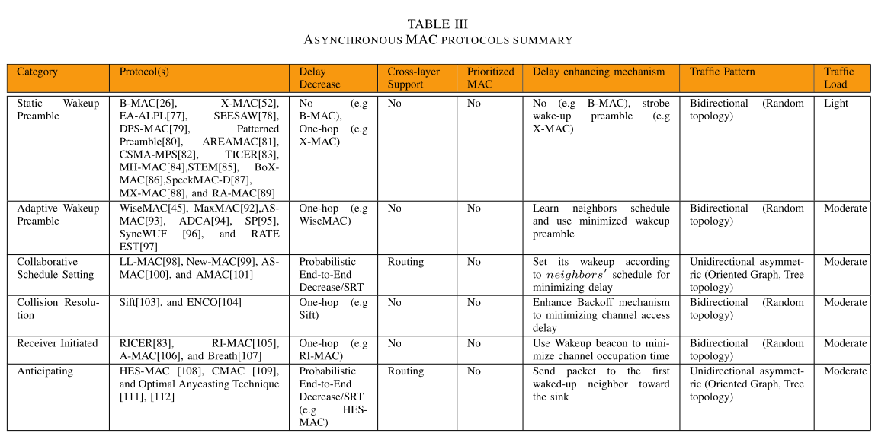

---

---

# Introduccion

Los sensores Inalambricos o mejor dicho, sensores con comunicación inalambrica; pueden construir una
red de comunicacion (basada en nodos repetidores/emisores) que sirve para comunicar los datos recopilados
por un sensor individualmente o repetir los datos captados por sus vecinos inmediatamente proximos.

La utilidad de este tipo de sensores se extiende desde la agricultura a baja escala hasta la industria, 
sin embargo la utilidad de los mismos tambien viene de la mano con la implicita necesidad de que 
tengan un funcionamiento desatendido.

Este desatendimiento requiere de que los sensores, dispositivos de poco tamaño, consuman poca energia.
Una forma practica de conseguir esto es apagandoce y encendiendose segun un itinerario, sin embargo
para que estos sensores se comporten como una red, se necesita que el emisor y receptor esten prendidos
por lo que todo sensor debe ser 'conciente' del itinerario particular de sus vecinos, aun que esto implique
otro consumo de energia.

La comunicacion via MAC (Control de Acceso al Medio) debe realizarse de manera asicrona para poder
cumplir con esta condicion de mixtura en los itinerarios, sin embargo puede crear pedida de paquetes
o retrazos en el envio de los mismos.

Es facil visualizar que si se dan muchas situaciones similares a la anterior descrita, usar este 
tipo de sensores, para comunicar multimedia o en ambientes medicos, puede resultar catastrofico. Por
lo que en el presente documento se revisara posibles causas del problema ademas de sugerencia de 
solucion.

# De lo Asicrono de la Comunicacion

Los protocolos implementados dentro de la capa (MAC) pueden clasificarse como sicrono o asicronos, 
los protocolos sicronos dependen continuamente no solo ser concientes del itinerario de sus vecinos
sino de forzarlos y forzarse a llegar a un 'itinerario consenso', de manera que trazar una ruta de 
menor retrazo sea posible, sin embargo este 'acuerdo general' implica un delay adicional.

Por otro lado, las redes de sensores asicronas, toman en consideracion un itinerario inicial y global
(tal vez consecuentes sincronizaciones globales, aka. *'Populate'*), para generar una tabla interna de 
esperas y propragaciones. Es decir, cada nodo es responsable de comunicar a todos sus nodos vecinos 
la informacion pertinente asumiendo estos nodos cumpliran con su itinerario por igual, aun que no en 
sicronia, pero que si lo llegaran a cumplir.

Debemos recodar que los procesos asicronos se basan en el concepto de **'promesa'**, donde se promete
y se es prometido por igual; que el mensaje enviado sera escuchado y que nostros (el nodo) escuchara 
los mensajes entrantes, mas no por ello en el preciso instante que se envio.

Esto puede incluir tambien la promesa de repeticion del mensaje o incluso la promesa de sincronizacion
de itinerarios.

# De la Arquitectura de las Redes

Las redes puede construir monocanal o muticanal, pudiendo tener dos o mas modulos o un solo modulo de comunicacion,
esto puede facilitar la parelizacion de mensajes (si un sensor con varios modulos de comunicacion estan
en modo monocanal, todos los modulos transmitirian en simultaneo, o a la inversa, podrian escuchar) o
la paralizacion de transmision (si un sensor con varios modulos de comunicación estan en multicanal,
unos modulos puede transmitir y otros escuchar, todo al mismo tiempo).

Aun que todo esto suene a ventajas debemos recordar, que la mayoria de modulos multicanal y plurimodular
suelen ser *'nodos maestros'*, diseñados especificamente para comportarse como retransmisores o acumuladores
mas no como nodos normales (con capacidad de sensor). Por lo que si un protocolo pone todo el peso 
de la comunicacion en estos nodos podria caer en el error de la "Falla de punto unico".

---

> Clasificacion de Protocolos segun su tipo de comunicacion y relacion al tiempo.
---

# Problemas que generan los retrazos

## Actualizacion de Itinerarios

Algunas veces, y por desincronizacion interna, algunos nodos, pueden alterar sus itinerarios, generando
desincronizacion con todos los demas itinerarios, por lo que se debe esperar que se envie un mensaje 
sincronizador o manejar esta amortiguandolo con envio continuo de mensajes hasta que se pueda volver a 
obtener comunicacion.

## Capacidad

Si un nodo se encuentra apagado por mucho tiempo, y esta sometido a un proceso sicrono, este tendra 
una larga cola de mensajes pendientes a procesar, de ser asicrono, el proceso sera peor: existira perdida
de mensajes.

Lo problematico se vuelve aun mas caotico si consideramos que estos nodos no estan en la capacidad de
o recuperar mensajes pidiendo el reenvio de los mismos o de procesar una gran cola de mensajes pendientes.

## Sobreescucha

Si un nodo queda permanentemente a la espera de que se cumpla la promesa de escucha, pero recibe
el preambulo de un mensaje que no le corresponde, este puede responder con un paquete de confirmacion,
generandose ademas de desincronizacion, perdida de datos; pues de todas manera habria un nodo a la espera
del preambulo que ya fue interceptado por otro nodo (quien no era el destino), manteniendose y propagandose
este error a lo largo de la red.

## Sobreemision

Si dos nodos se comunican, pero uno se encuentra apagado, el nodo de origen puede decidir dejar pasar 
el mensaje y enviarlo a otro destinatario, sin embargo si solo existe un unico destino, este nodo de 
origen, mantendra un continuo envio de mensaje, ampliando la cola de mensajes en el nodo destino y 
creando retrazo posteriormente.

## Colision

Si dos nodos intentan comunicarse con un nodo no disponible, pueden acordar omitirlo en la comunicacion,
sin embargo al redisponibilzarse, este nodo pedira se le reenvie los paquetes omitidos, recibiendo el mismo
preambulo que ya ha circulado por la red, creando colision. Este caso es aun manejable, sin embargo,
para casos donde dos nodos intentan comunicarse con un nodo no disponible mandando exactamente el mismo
preambulo, al disponibilizarse, este nodo tendra un conflicto y generara retrazasos.

## Variaciones del Trafico

El mero hecho de tener que omitir un nodo por encontrarse faltante o tener que esperarlo, ademas
de las interferencias ambientales, pueden generar retrazos desde cortos hasta muy prolongados.

# Solucion a los Problemas de Retrazos 

## Preambulo con Sincronizacion Adaptativa

Es la adicion de un valor sincronizador, no de la comunicacion sino del itinerario; el cual tenga 
memoria de las etapas anteriores y pueda sincronizar los itinerarios locales alterando su tiempo
en encendido o el tiempo que debe seguir apagado.

## Acuerdo de Itinerario Colaborativo

El preambulo de todo mensaje contiene el estado en el que se encontro y en que tiempo los nodos tardaron
en contestar, de manera que todos los nodos vecinos tienen una vista de como se encuentran los demas,
permitiendo balancear y alinear los itinerarios lo mejor posible respecto a todos y no respecto al primer
nodo que se comunique con ellos.

Esta solucion reduce el numero de actualizaciones en los itinerarios pero aumenta la longitud del preambulo
haciendo mas facil se pierdan paquetes.

## Protocolos iniciados por el Receptor y Protocolos Anticipados

Estos Protocolos se basan en la idea que, si un nodo no ha escuchado de sus demas vecinos es que estos
estan no disponibles o lo han dejado de lado por el haber estado mucho tiempo no disponible, es aqui
donde el nodo en desventaja procede a emitir un largo preambulo donde incluye su itinerario actual
y un mensaje notificando de los posibles mensajes perdidos segun su propio itinerario.

Una variacion 'fuerte' de este protocolo es en el que si un nodo detecta retrazos o execeso de promesas
de escucha, el nodo emite un mensaje, cuyo preambulo avisa que el esta disponible y en permanente escucha
y un cuerpo con los retrazos respecto a todos los demas nodos.

Es una forma de solucionar el problema, donde el nodo en desventaja fuerza una cooperacion disminuyendo
los desfases entre nodos.

# Tabla Resumen

---

---
